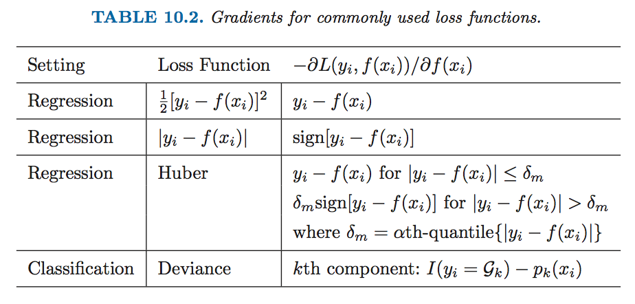
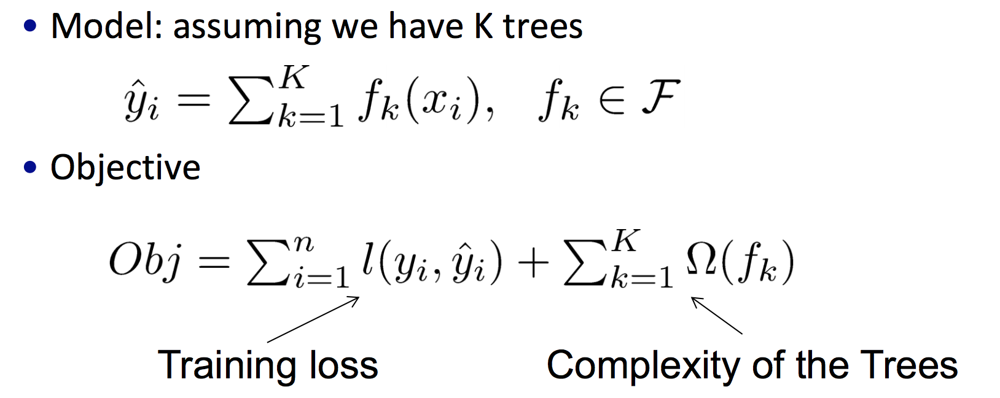
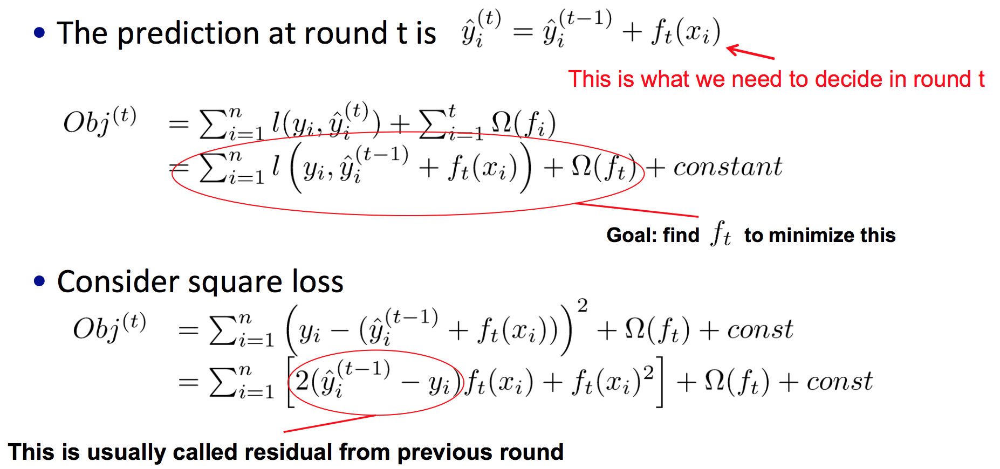
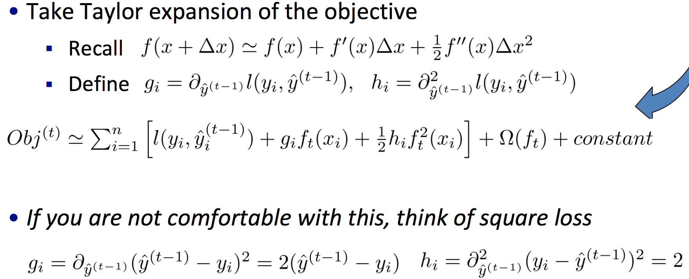
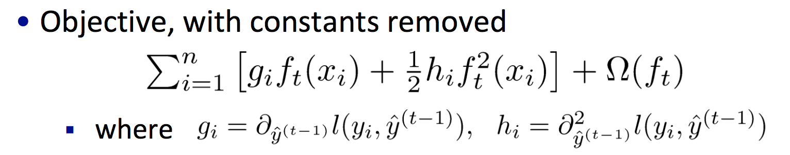
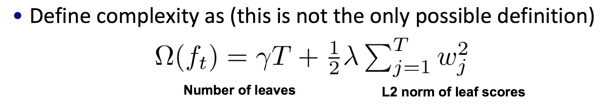
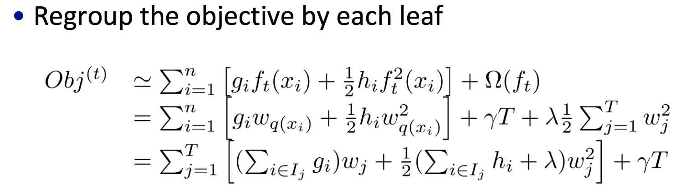
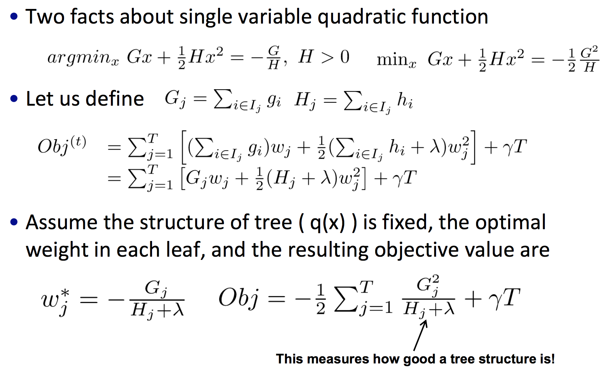
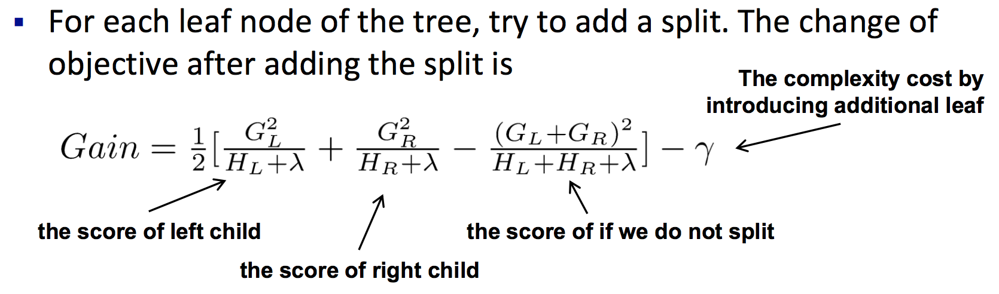
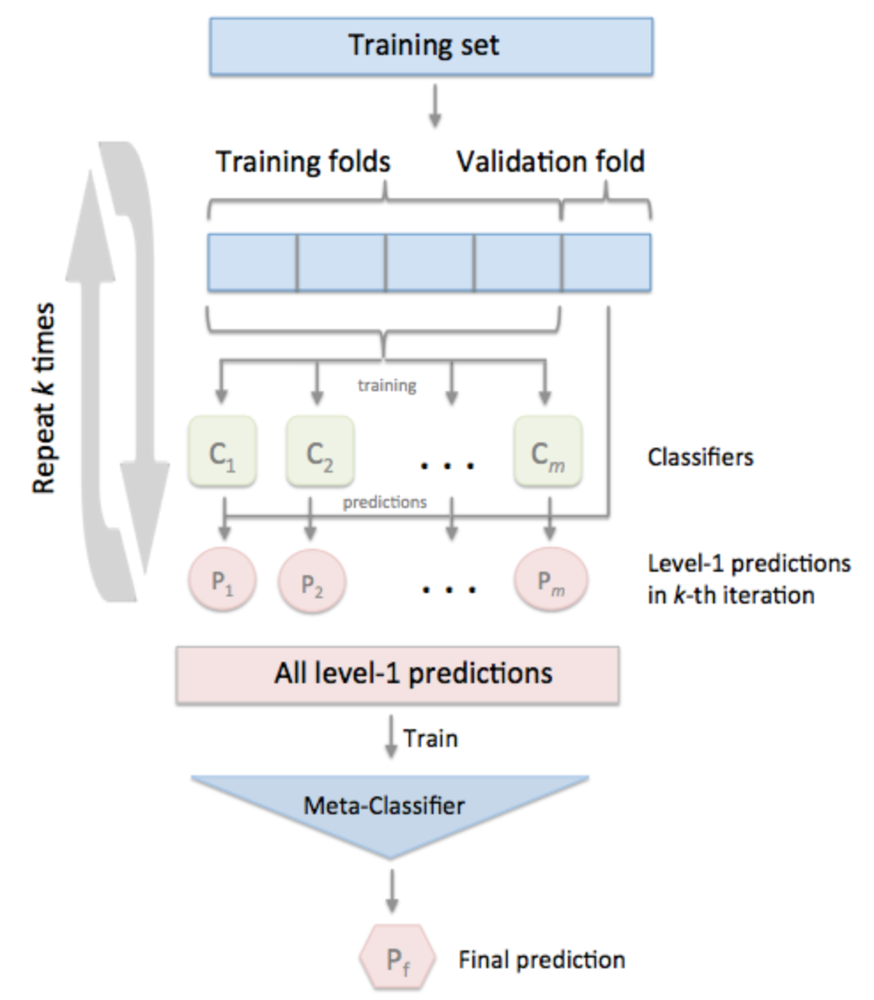

集成学习
========================================
集成学习的目的,就是把一些个体基学习器按照某种策略融合到一起,形成一个比每个单一基学习器效果都要好的融合模型。

Bagging
---------------
给定包含m个样本的数据集,有放回地抽样m次,得到一个含m个样本的子集(初始训练集中有63.2%的样本出现在该子集中)。如此进行T次操作,即可得到T个含m个样本的采样集。基于每个采样集训练出一个基学习器,再将它们结合:分类问题可以采用简单投票法,回归问题可以采用简单平均法。

Random Forest
~~~~~~~~~~~~~~~~
随机森林是最典型的Bagging扩展体之一。其基分类器为决策树,除了对样本进行有放回的抽取之外,每次还会随机选择k个属性进行训练,最后对结果进行结合。

随机森林的每个基分类采用的是部分属性和部分样本进行训练,因此每棵基树都会学的很深,然后再结合。这样的策略与boosting有很大的区别。

Boosting
---------------
首先从初始训练集训练出一个基学习器,再根据分类结果对样本进行权重调整,被错误分类的样本会得到较高的权重,受到更多的关注,形成新的样本进行下一轮的训练,直到指定的T轮。最终将这T个基学习器加权结合。

相比与Bagging,Boosting更关注于降低偏差。所以每个基分类都不会训练得太深,而是采取多次迭代提升的策略,来防止过拟合。

提升方法最常见的使用场景时在决策树上。

Adaboost
~~~~~~~~~~~~
设训练数据集 :math:`T={(x_1,y_1),(x_1,y_1),\cdots ,(x_N,y_N)}`, :math:`y_i\in \{-1,1\}`

* 分类

1. 初始化训练数据的权值分布

.. math::
    D_1=(w_{11},\cdots ,w_{1i},\cdots ,w_{1N}),\ w_{1i}=\frac{1}{N},\ i=1,2,\cdots,N

2. 使用具有权值分布 :math:`D_m` 的训练数据集学习,得到基分类器 :math:`G_m(x)`
    
3. 计算 :math:`G_m(x)` 在训练集上的分类误差率

.. math::
    e_m=P(G_m(x_i\ne y_i)) = \sum_{i=1}^Nw_{mi}I(G_m(x_i)\ne y_i) 

4. 计算 :math:`G_m(x)` 的系数

.. math:: 
    \alpha_m=\frac{1}{2}\log \frac{1-e_m}{e_m}

5. 更新训练集的权值分布

.. math::
    D_{m+1}=(w_{m+1,1},\cdots ,w_{m+1,i},\cdots ,w_{m+1,N})

.. math::
    \begin{align}
    w_{m+1,i} &= \frac{w_{mi}}{Z_m}\exp (-\alpha_my_iG_m(x_i)) \\
    &= 
    \begin{cases}
    \frac{w_{mi}}{Z_m}e^{-\alpha_m} & G_m(x_i)=y_i \\
    \frac{w_{mi}}{Z_m}e^{\alpha_m} & G_m(x_i)\ne y_i
    \end{cases}\\
    \end{align}

其中 :math:`Z_m` 是规范化因子

.. math::
    Z_m = \sum_{i=1}^Nw_{mi}\exp (-\alpha_my_iG_m(x_i))

6. 构建基本分类器的线性组合

.. math::
    f(x)=\sum_{m=1}^M\alpha_mG_m(x)

得到最终分类器

.. math::
    G(x)=sign(f(x))=sign\left(\sum_{m=1}^M\alpha_mG_m(x)\right)

* 回归

区别于分类问题,在回归问题上,则是拟合当前模型与目标之间的残差。总之,取决于损失函数的定义。

当Adaboost的基分类器为决策树时,则被称为 **提升树** 。此时一般采用CART作为基分类器,所以是二叉树。

提升树一般会通过调整learning rate来防止过拟合。

GBDT
~~~~~~~~~~~~
GBDT,即梯度提升树,则是利用当前模型损失函数的负梯度值,作为残差的近似值去拟合:

.. math::
    F_m(x) = F_{m-1}(x)+\gamma_mh_m(x)

.. math::
    \gamma_m = \arg \min_{\gamma}\sum_{i=1}^nL\left(y_i,F_{m-1}(x_i)-\gamma\frac{\partial L(y_i,F_{m-1}(x_i))}{\partial F_{m-1}(x_i)} \right)

加上学习率:

.. math::
    F_m(x) = F_{m-1}(x)+\nu \gamma_mh_m(x),\ 0<\nu \leq 1

常用的损失函数如下表:

由上表可以看出,在回归问题上采用误差平方和作为损失函数,其负梯度值即为残差,而在分类问题上一般会映射成概率,其常用的损失函数为:

.. math::
    L(y_i,f(x_i)) = \log (1+e^{-y_if(x_i)})

在正则化上,除了学习率外,GBDT还可以在每次提升时采用随机无放回的样本采样(行采样)方式,即用随即梯度下降的方式来提高泛化能力。

XGBoost
~~~~~~~~~~~~
与GBDT不同处在于,XGBoost在目标函数中添加了正则项:

对于误差损失的部分,XGBoost对损失函数进行了一个泰勒二阶展开:

注:其中 :math:`\widehat{y}_i^{(t)},\ y_i` 都是常数，一些常数项都被加到了 :math:`const` 里:

此时,目标函数就可转化成:

对于当前树的正则部分,包含了叶结点个数,以及对预测值做了平滑处理,防止过拟合:

重新定义目标函数,将目标函数整理到每个叶当中:

通过转换可以得到最小目标函数:

将特征值排序,遍历每个特征值,寻找最优切分点,是的损失函数的降低增益最大:

XGBoost的亮点主要有:

1. 目标函数中增加了正则项,考虑了叶结点数量和分值平滑的因素;

2. 对损失函数进行了泰勒二阶展开,相比GBDT中的一阶导数,多了残差的二阶导数,准确度有所提升;

3. 支持列抽样;

4. 支持并行计算。

LightGBM
~~~~~~~~~~~~
LightGBM相较于XGBoost,在各方面又有了提升:

1. LightGBM在寻找切分点时,对连续的特征值采用了基于直方图的算法,即将连续值离散化。这样的算法相较于XGBoost的预先计算存储,速度更快,也减少了内存的消耗;

2. 传统的决策树采用的是level_wise的方式增长,这样往往会分裂一些不必要的结点:

.. image:: ../images/ensemble_level_wise.png
    :width: 500px
    :align: center 

而leaf_wise只对最值得分裂的结点做切分,在准确度上也有所提升:

.. image:: ../images/ensemble_leaf_wise.png
    :width: 500px
    :align: center 

3. LightGBM在并行计算上也进行了各项优化。

总之,个人使用后的感受是,准确度与XGBoost差不多,但是速度要快不少。

Stacking
---------------
多基分类器的结合策略,在分类问题上常用简单投票法,回归问题常用平均法,也可以根据使用场景进行加权。还有一种常用的学习法叫 **Stacking** ,它是以每个基分类器的预测值作为样本,进行再次学习(如用逻辑回归..)。Stacking在使用时往往配合交叉验证。

假设用 :math:`m` 个分类器 :math:`C_m` 对数据集(n个样本)进行  :math:`k`  折交叉堆叠:

1. 每次的交叉验证都是用 :math:`C_m` 对当前训练集拟合,对验证集的预测值作为输出,可以得到 :math:`m` 列, :math:`\frac{n}{k}` 行的结果集;

2. 如此进行 :math:`k` 轮训练,将结果纵向堆叠,即可得到一个 :math:`m` 列, :math:`n` 行的结果集;

3. 将该结果集作为样本,用一个Meta-Classifer预测,得到最终结果。

使用Stacking最理想的方式是使用m个相互独立,各有所长,且准确度差异不大的基分类器:使用类似的模型进行堆叠,没有太大效果;而分类器差异大,效果往往还不如最好的那个基分类器。

